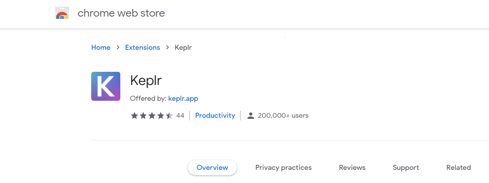

# How to Import Your BitSong Wallet

**1.** Make sure you have installed the **Keplr** browser extension. If you don't already have it, then you can download the extension and install it from [**here**](https://chrome.google.com/webstore/detail/keplr/dmkamcknogkgcdfhhbddcghachkejeap?hl=en)**.**

**2.** Once you have your Keplr extension installed, open it. In the new window that opens, select "_Import existing account_."

**3.** This is probably the most important step! Insert your BitSong mainnet Mnemonic Key. Then you can name your wallet, set a password, and proceed.&#x20;

**4.** You have now your Cosmos Wallet ready to use!

.png>)

**5.** Go to [https://wallet.bitsong.io/](https://wallet.bitsong.io) and among the options in the first window, select "_Keplr Browser Extension,_" per the image below.&#x20;

**6.** Wallet.bitsong will then execute Keplr and will prompt you to **add and connect the bitsong-2b** chain. You must approve both actions by signing them with Keplr.

**7**. Open the Keplr extension. and from the list of available chains, scroll down until you find "_**BitSong Mainnet**_" and select it.

**8.** Congratulations, you have just imported your BitSong Wallet! You can see the new wallet address on the top left under the BitSong logo.

.png>)

**9.** Make sure that the BitSong wallet address shown in Keplr is the same as the one shown wallet.bitsong.io.

